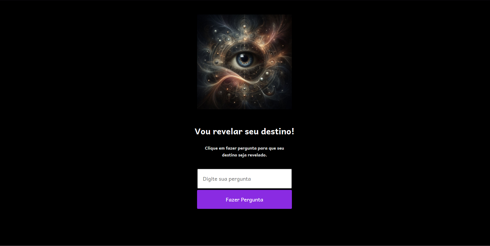

# Destiny

<h1 align="center"> Destiny </h1>

 

  <a href="#-tecnologias">Tecnologias</a>&nbsp;&nbsp;&nbsp;|&nbsp;&nbsp;&nbsp;
  <a href="#-projeto">Projeto</a>&nbsp;&nbsp;&nbsp;|&nbsp;&nbsp;&nbsp;
  <a href="#-licença">Licença</a>

  

 

  

## 🚀 Tecnologias

Esse projeto foi desenvolvido com as seguintes tecnologias:

- HTML e CSS
- JavaScript
- Git e Github

## 💻 Projeto

O Destiny é uma aplicação feita para ser um adivinhador do futuro, e tem como objetivo entreter.

- [Acesse o projeto finalizado, online](https://fellypsb.github.io/Destiny)

## 📝 Licença

Esse projeto está sob a licença MIT.

---

Esse projeto só foi possível graças a Rocketseat 🚀 [Participe da nossa comunidade!](https://discord.gg/rocketseat)   
Powered by Fellype
